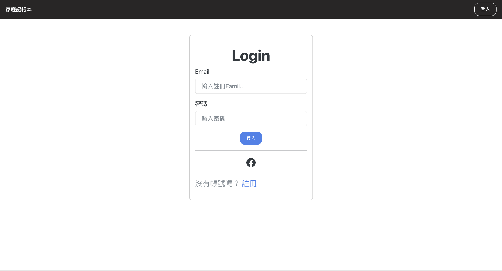
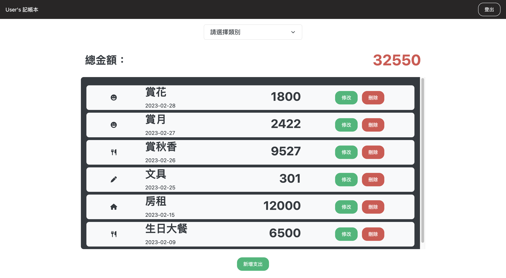

# Restaurant-List




## 介紹

一個簡單的記帳網頁程式。

## 功能

- 使用者可以使用會員功能進行註冊帳號及登入
- 使用者可以使用第三方登入：以 Facebook 註冊及登入
- 使用者可以新增、編輯、刪除支出資料
- 使用者可以查支出總金額
- 使用者可以按照類別瀏覽特定資料及其總額

## 線上版

請進入[此網站](https://murmuring-lowlands-41352.herokuapp.com/)並使用**試用帳號**或**自行註冊**使用：

| email            | password |
| ---------------- | -------- |
| user@example.com | 12345678 |

## 開始使用

1. 請先確認有安裝 node.js 與 npm，套件版本詳見下方[開發工具](#開發工具)
2. 將專案 clone 到本地
   ```bash
   git clone https://github.com/RayYangTW/expense-tracker.git
   ```
3. 依照 .env.example 設定環境變數
4. 建立種子資料

   ```bash
   npm run seed
   ```

5. 在本地開啟之後，透過終端機進入資料夾，輸入：

   ```bash
   npm install
   ```

6. 安裝完畢後，繼續輸入：

   ```bash
   npm run start
   ```

7. 若看見此行訊息則代表順利運行，打開瀏覽器進入到以下網址

   ```bash
   App is running on http://localhost:3000
   ```

8. 建立種子資料後可以種子帳號使用，或自行註冊

   ```bash
   email: 'user1@example.com',
   password: '12345678'
   ```

9. 若欲暫停使用

   ```bash
   ctrl + c
   ```

## 開發工具

- node.js 16.18.0
- mongoDB
- bcryptjs @2.4.3
- connect-flash @0.1.1
- dotenv @16.0.3
- express @4.18.2
- express-handlebars @6.0.7
- express-session @1.17.3
- method-override @3.0.0
- mongoose @6.9.0
- passport @0.6.0
- passport-facebook @3.0.0
- passport-local @1.0.0
- Bootstrap @5.0.2
- Font-awesome
